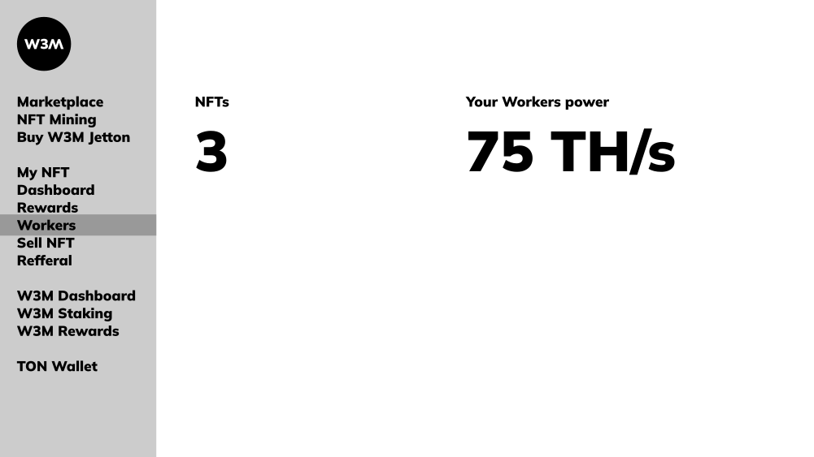

# Hashrate

> Hashrate или Вычислительная мощность майнера — это количество вычислительных ресурсов, измеряемое в хэшах в секунду (H/s), которое устройство или сеть способно внести в процесс проверки и добавления транзакций в цепочку блоков.

Web3Mining NFT, как и настоящие, обладают вычислительной мощностью, поскольку они подкреплены мощностью реальных майнеров в центрах обработки данных. Каждый из NFT изначально настроен на вычислительную мощность для майнинга.

Hashrate NFT измеряется в TeraHash/s (TH/s).

> 1 TH = 1000000000000 H

Приобретая NFT из коллекции W3M, держатель получает часть вычислительной мощности парка устройств, которые уже заняты майнингом BTC.

Вычислительная мощность каждого NFT будет расти по мере подключения реального оборудования к пулу майнинга проекта. Чем больше вычислительной мощности у NFT, тем больше наград вы получите в режиме SBT W3M NFT и тем больше шансов выиграть в режиме пула.

