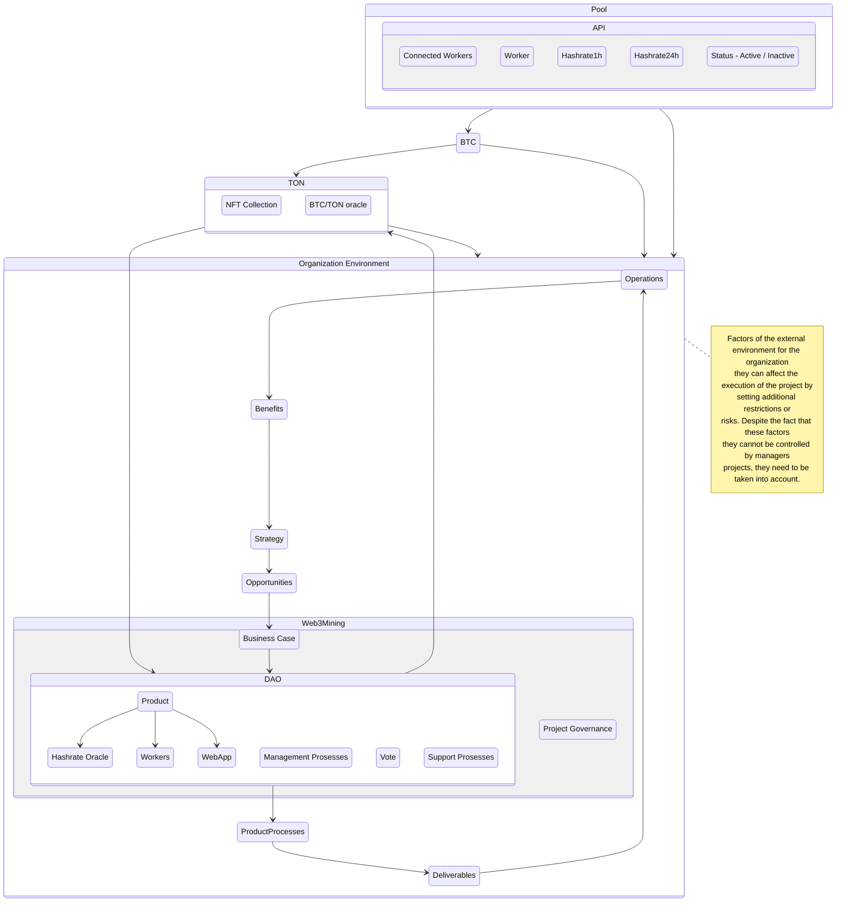
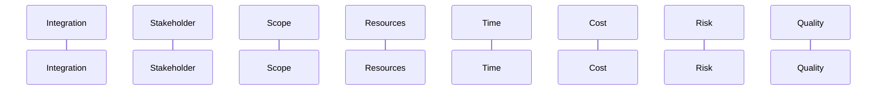
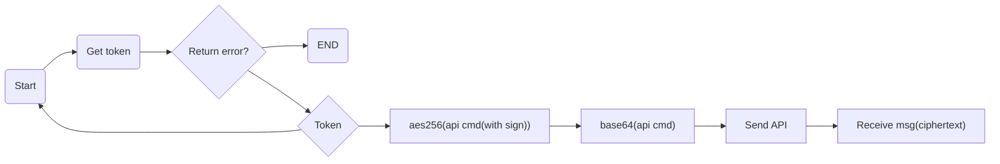

# Whitepaper: On the way to managing the sphere of decentralized BTC mining as a self-developing environment.

### Statement of the problem of improving the mechanisms for managing the computing power of BTC workers

_Signs of a systemic crisis in traditional BTC Mining_

In the most general form, it is advisable to determine the economic efficiency of Web3Mining through the profitability indicator:

$$R_m={P \over \sum(C)}100 $$

where:

- $$R_m $$
  profitability of mining;
- $$P $$
  profit received from the sale of cryptocurrencies;
- $$\sum(C) $$  
  costs associated with the mining process.

This document describes the key concepts of Web3Mining. It also describes the environment in which computing node projects are implemented.

The diagram shows the relationship between the key concepts of project management. The strategy of the organization allows you to identify opportunities, which are then evaluated and documented in the form of an investment proposal or a similar document. To realize these opportunities, one or more projects can be launched in order to achieve results. These results can be used to achieve benefits, and the benefits achieved, in turn, are taken into account when developing an organization's strategy.



|                              |
| ---------------------------- |
| External Environment         |
| Organization Environment     |
| Organizational Strategy      |
| Benefits                     |
| Opportunities                |
| Project Environment          |
| Governance                   |
| Business Case                |
| Project Organization         |
| Operations                   |
| Deliverables                 |
| Project                      |
| Project Management Processes |
| Product Processes            |
| Support Processes            |

## Terms and definitions

The following terms and definitions are used in this document:

- **Bitcoin (BTC)**: A decentralized digital currency generated by computing power networks. It can be used in many areas to make online payments instead of traditional fiat currencies.

- **NFT**: A non-fungible token used as a unit of data stored on a blockchain that certifies the uniqueness of a digital resource

- **activity**: The identified fragment of activity within the calendar schedule, the implementation of which is necessary to complete the project.

- **Application area**: A category of projects that have a common focus in relation to a product, client or economic sector.

- **baseline**: A framework for comparing, tracking, and monitoring project performance.

- **change request**: A document that defines the proposed changes in the project.

- **project configuration management**: Application of procedures for control, coordination and maintenance of documentation, technical characteristics and attributes.

- **control**: Comparison of actual performance indicators with planned indicators, analysis of deviations and implementation, if necessary, of appropriate corrective and preventive actions.

- **corrective action**: Instructions and actions to change the ways of performing work aimed at bringing project performance indicators in line with the plan.

- **critical path**: A sequence of works/operations, which determines the earliest possible completion date of the project or phase of the project.

- **delay**: An attribute of a logical dependency that determines the delay in the start or end of subsequent work.

- **lead**: An attribute of a logical dependency that determines the earlier start or end of subsequent work.

- **preventive action**: Prescriptions and final actions designed to make changes to current work in order to eliminate or reduce potential deviations from the existing work plan.

- **project life cycle**: A certain sequence of phases that lasts from the beginning to the end of the project.

- **risk register**: A list of identified risks, including the results of the analysis and planned measures to respond to risks.

- **stakeholder**: A natural or legal person who has an interest can influence any aspects of the project, is subject to or considers himself subject to any influence from the project.

- **proposal**: A document in the form of a proposal for the supply of a product, service or result, usually in response to an invitation or request

- **work breakdown structure dictionary:** A document containing a description of all the elements of the decomposition structure of the project.

## Introduction

The digital economy is an economy that develops by saving advanced information technologies.

Cryptocurrency is virtual money, which, unlike fiat money, is not widely used. The unit of such a currency is "coin" (translated from English - "coin"). A feature of the currency is protection against forgery, since it encrypts data that cannot be duplicated. The key feature of the cryptocurrency is the absence of any internal or external administrator. Therefore, banks, tax, judicial and private authorities cannot influence the size of any participants in the payment system. The transfer of cryptocurrency is irreversible - no one can cancel, block, challenge or demand (without a private key) the transaction. Cryptocurrency is an internal unit of account of any public market (Public blockchain), i.e. campaign in which mining is used (in the form of PoW or PoS). Mining is a necessary and important process in public attraction, and public interest cryptocurrency in the area of ​​incentives for miners. In addition, cryptocurrency is used for transaction fees.

### What is Web3Mining?

W3M is the first example of a "Non-Fungible Token" backed by real Worker power. It’s an inspiration for the [TEP-62](https://github.com/ton-blockchain/TEPs/blob/master/text/0062-nft-standard.md) standard that powers Web3, Workers and bitcoin mining.

:::tip
Smart contract: [NFT Collection](https://github.com/web3mining/token-contract/blob/main/nft/nft-collection.fc)

Smart contract: [NFT Item](https://github.com/web3mining/token-contract/blob/main/nft/nft-item.fc)
:::

### General Principles

Built For Miners by Miners

Web3Mining is a DAO with a mission to simplify the intricate world of crypto mining. We have been in the industry since 2014, working on the full cycle of BTC mining. Our skill sets include:

1. Construction of data centers.
2. Production of modular prefabricated buildings to accommodate equipment.
3. Production of our own automatically controlled service centers.
4. Development of a unique monitoring system to provide 99.8% uptime.
5. Testing and implementation of different firmware, and successful testing of different temperature regimes and equipment placement formats.

We decided to offer the community a universal and convenient product suitable for both professional market players and crypto enthusiasts: we have created a unique NFT collection Workers, backed by the real computing power of our device fleet.

### What does a holder of the W3M NFT collection get?

1. Weekly TON rewards in you wallet
2. Choice of NFT in terms of power and energy efficiency
3. A pool game with the potential to mine more BTC

### NFT Workers

Each NFT of W3M collection is initially configured with computing power for mining. The computing power of each NFT will grow as real equipment is connected to the project's mining pool.

The overall Workers power of the collection is XX,XX TH/s. There are XX,XX NFTs in total.

### NFT Energy Efficiency

NFT miners can vary not only in terms of computing power, but also in their energy efficiency.

We’d like to point your attention to NFTs featuring the following energy efficiency values:

- Air Cooling — 50 W/TH
- Hydro Cooling — 25 W/TH

### Principles of Mining Rewards Distribution

RI = PI - ((F1+F2)\*(1-Σd))-(F3+F4)

> The accrual is awarded only if Reward>0.

- RI - Reward income - amount of BTC accrued to the NFT holder at a rate of 1 TH a day
- PI - Pool Income - amount of BTC accrued by the pool at a rate of 1 TH a day (Rewards type: fpps - minus fee)
- Σd - Sum of discounts for F1 and F2 fees and can be obtained via gaming activities
- F1 - costs per 1 TH a day
- F2 - service and infrastructure costs at a rate of 1 TH a day.
- F3 - contribution to the insurance pool calculated at 1-3% of the pool accrual amount at a rate of 1 TH a day.
- F4 - management costs calculated at 8% of the pool accrual amount at a rate of 1 TH a day.

### Reward Income

The actual amount of BTC is distributed once a day via FPPS. An important factor is that the actual distribution of mining rewards is conducted directly from the respective pool via which the power is channeled to the wallet of the NFT holder. This mechanism ensures maximum transparency for NFT holders.

### Pool Income

The actual amount of BTC is accrued daily by the pool for 1 TH/s via FPPS. 'PI' is a dynamic value, and can change according to BTC network settings. Calculated parameters for PR are always up to date on the pool's website.

### F1 (Electricity Costs)

The electricity costs for each NFT in the collection are calculated using the following formula:

> F1 = (kWh cost*24) / 1000 / BTC course in USD * Energy efficiency \* Hashrate

### F2 (Service Costs)

The UPTIME of our devices is 99.8%. This high uptime is achieved due to the timely service and round-the-clock monitoring by our on-site technical support engineers.

Service is a calculated value. Based on statistics from past years, service charges for 1 TH per day is $0.0089.

As with electricity, we will calculate the cost of servicedaily at the BTC rate at the time of payment.

The monthly cost of maintenance is calculated and approved for a period based on the results of an internal audit.

> F2 = 0.0089$ / BTC course in TON \* Hashrate

### F3 (Insurance Costs)

The volatility of BTC always carries risks of mining unprofitability, i.e., when the cost of consumed electricity is higher than the value of the rewards received.

Weekly insurance contributions are received and stored in dedicated TON wallets.

A situation in which RI<0 may arise during an extreme and prolonged drop in BTC price, when the cost of consumed electricity will be higher than the rewards received in TON.

> In our model, we have foreseen such low profit situations and created an insurance fund, where we contribute 2% of all accruals from the pool.
>
> The insurance fund is made to cover any negative difference in the cost of electricity in the event of an extremely low drop in the BTC rate and other force majeure situations.

To avoid equipment shutdown and continue to distribute BTCs, we have developed the following response protocol:



:::info

1. In the event of a sharp drop in BTC, we will stop making contributions to the insurance fund (F3), and redirect funds to cover expenses (F1).
2. If insurance premiums do not cover electricity costs, we will send management cost payments (F4) to cover costs (F1).
3. If insurance premiums and management costs (F4) do not cover electricity costs (F1) we will implement the insurance fund.

:::

### F4 (Management Costs)

Management costs – are the costs for IT development, management, and legal support of the project.

### ROI

- Anticipated ROI is calculated based on current BTC rewards. It shows how NFT may pay off in the future.
- Electricity fee - It's a share that we deduct from your pool reward. The lower the W/TH of the NFT, the lower the F1 electricity fee, so your net reward is higher.
- Reward - The sum of your BTC rewards over the period converted into TON at the current exchange rate.
- Payback period
- Historical ROI is calculated based on real historical data of BTC rewards. It shows how NFT would have paid off if you had bought it earlier.

### Tokenomics

NFTs are issued on the TON blockchain using the TEP-62 standard.

Contract Collection:

Jetton: W3M jetton
Collection: W3M NFT Collection

The computing power of each NFT will grow as real equipment is connected to the project's mining pool. As we roll out new capacity (by connecting new miners) at the data centers for the NFT project, we will put more computing power into the issue, whereby through redistribution, the value (in terms of computing power) of each separate NFT will grow.

### Worker Network Environment

### Protocol

API TCP Worker

> Notice:
>
> 1. If no data is received within 10 seconds after the port is connected, the
>    connection will time out and be closed.
> 2. `worker` supports max 16 IP clients, one IP can get 32 tokens, and a token
>    keepalive time is 30 minutes

JSON API return format:

```json
{
    "STATUS": "string",
    "When": 12345678, #integer
    "Code": 133,
    "Msg": "string", #string or object
    "Description": "string",
}
```

Message Code:

| Code | Message                     |
| ---- | --------------------------- |
| 14   | invalid API command or data |
| 23   | invalid JSON message        |
| 45   | permission denied           |
| 131  | command OK                  |
| 132  | command error               |
| 134  | get token message OK        |
| 135  | check token error           |
| 136  | token over max times        |
| 137  | base64 decode error         |

#### API ciphertext

Notice: the readable API supports two communication modes: plaintext and ciphertext; the writable API supports only ciphertext communication.

Encryption algorithm:

```
Ciphertext = aes256(plaintext)，ECB mode
Encode text = base64(ciphertext)
```

Steps as follows:

```(1)api_cmd = token,$sign|api_str
(2)enc_str = aes256(api_cmd, $key)
(3)tran_str = base64(enc_str)
api_str is API command plaintext
```

Generate aeskey step：

```
(1)Get token from worker: $time $salt $newsalt
(2)Generate key:
key = md5(salt + admin_password)
Reference code:
key = `openssl passwd -1 -salt $salt "${admin_password}"`
(3)Generate aeskey:
aeskey = sha256($key)
```

e.g.:

```set_led|auto ->
token,$sign|set_led|auto ->
ase256("token,sign|set_led|auto", $aeskey) ->
base64(ase256("token,sign|set_led|auto", $aeskey) ) ->
enc|base64(ase256("token,sign|set_led|auto", $aeskey))
```

JSON:

```json
{
    "enc": 1, # integer
    "data": "base64 str"
}
```

#### The flow



#### Writable API

Writable API only supports ciphertext.

The writable API must first obtain the token as follows:

```json
client -> worker

{"cmd":"get_token"}

worker -> client：

{"time":"str","salt":"str","newsalt":"str"}

e.g.：

{"time":"5626","salt":"BQ5hoXV9","newsalt":"jbzkfQls"}
```

**time**: timestamp, this count starts at the Unix Epoch on January 1st, 1970 at UTC.

**salt**: a random salt is generated for each password

**newsalt**: new salt for sign

Token calculation method:

Get token from worker: time salt newsalt.

1. calculate key use admin’s password and salt.
2. time is the last four characters of time.

key = md5(salt + admin_password)

sign = md5(newsalt + key + time)

The reference code in Ubuntu:

First, Get those values from worker: $time $salt $newsalt.

```bash
key = `openssl passwd -1 -salt $salt "${admin_password}"|cut -f 4 -d '$'`
sign=`openssl passwd -1 -salt $newsalt "${key}${time:0-4}"|cut -f 4 -d '$'`
```

#### Update pools information

This operation updates the pool configuration and switches immediately.

```json
{
  "token": "str",
  "cmd": "update_pools",
  "pool1": "str",
  "worker1": "str",
  "passwd1": "str",
  "pool2": "str",
  "worker2": "str",
  "passwd2": "str",
  "pool3": "str",
  "worker3": "str",
  "passwd3": "str"
}
```

#### Restart btminer

This operation only restarts the btminer process, not the control board.

```json
{
  "token": "str",
  "cmd": "restart_btminer"
}
```

#### Power off hashboard

This operation simply stops mining and turns off the power output of the power board. When respbefore is true, the miner returns the data first and then closes the hashboard, otherwise close the hashboard first and then return the data.

```json
{
    "token": "str",
    "cmd": "power_off",
    "respbefore": "str" # str value must be "true" or "false"
}
```

#### Power on hashboard

This operation simply starts mining and turns on the power output of the power board.

```json
{
  "token": "str",
  "cmd": "power_on"
}
```
